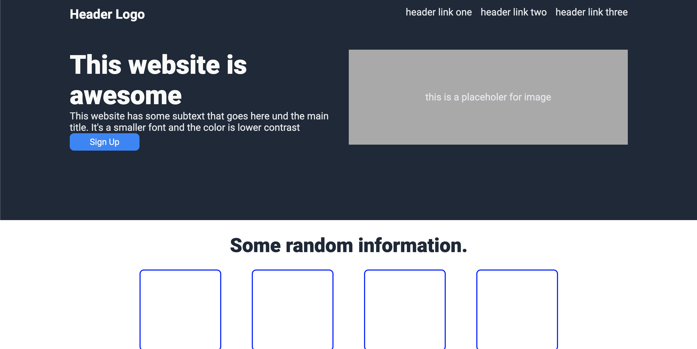
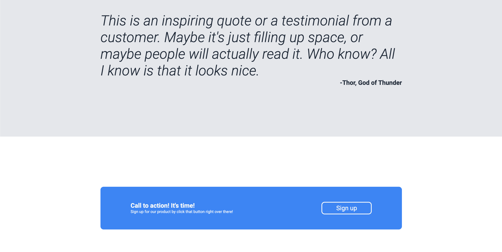

# Landing Page
A quick CSS layout for The Odin Project

**Link to project:** this project is not hosted at this time, below are a couple screenshots of the project

## How It's Made:

**Tech used:** HTML, CSS

Made this with just HTML and CSS, it is an excercise to pratice some styling and flexbox.

## Lessons Learned:

Be sure to pay attention to spelling. Easy projects can become difficult when there are typo's in class names.